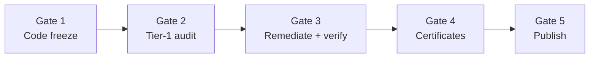

# Security Audit Completion Gates

Official checklist for **external** security audit completion. These gates are binding for mainnet launch and investor disclosure. They are separate from internal simulation confidence (SIM100, ATU, CCR fuzz) documented in [`INVESTOR_SECURITY_SUMMARY.md`](INVESTOR_SECURITY_SUMMARY.md).

**Engagement scope:** [`EXTERNAL_AUDIT_REQUIRED.md`](EXTERNAL_AUDIT_REQUIRED.md) · **Data room:** [`audit_data_room.md`](audit_data_room.md) · **Code freeze:** [`CODE_FREEZE.md`](../../CODE_FREEZE.md)

---

## Gate sequence



| Step | Gate | Binding outcome |
|------|------|-----------------|
| 1 | Smart contract / substrate codebase frozen | Auditors review a fixed commit hash |
| 2 | Tier-1 audit firms complete full security audit | Independent third-party report delivered |
| 3 | All vulnerabilities resolved and verified | Critical/High closed or formally waived |
| 4 | Public Security Audit Certificates issued and signed | Firm-issued certificate + sign-off letter |
| 5 | Audit reports published to official documentation channels | Investors and exchanges can cite public artifacts |

---

## Current status (honest)

| Gate | Status | Notes |
|------|--------|-------|
| **1 — Code freeze** | **Partial** | [`CODE_FREEZE.md`](../../CODE_FREEZE.md) defines L1 frozen surfaces; Task 59 pre-deploy sim **Partial** ([`l1_launch/checklist.md`](../l1_launch/checklist.md)). Post-freeze changes require governance vote + 48h timelock. |
| **2 — Tier-1 audit** | **Not started** | No external firm engaged. Internal prep (`l1_substrate_audit.sh`, genesis-verify) may run before engagement. |
| **3 — Remediate + verify** | **Blocked** | Awaiting Gate 2 findings. |
| **4 — Certificates** | **Blocked** | Awaiting Gates 2–3. |
| **5 — Publish** | **Blocked** | Awaiting Gates 2–4. |

**Internal simulation confidence** (SIM100, ATU 10001, immutability tests) is **not** a substitute for any gate above. See [`internal_audit_report.md`](internal_audit_report.md).

---

## Gate 1 — Smart contract codebase frozen

**Objective:** No further mutations to in-scope launch code after the audit baseline commit is tagged.

### Acceptance criteria

- [ ] L1 launch surfaces listed in [`CODE_FREEZE.md`](../../CODE_FREEZE.md) are frozen at a single Git commit (tag recorded in data room).
- [ ] `bash scripts/audit/l1_substrate_audit.sh` passes on that commit.
- [ ] `cargo run -p clarity-cli -- chain genesis-verify` matches `tokenomics_manifest.json`.
- [ ] `bash scripts/predeploy/l1_launch_simulation.sh` passes (Task 59).
- [ ] Any post-freeze change follows governance snapshot vote (Task 51) + 48h timelock (Task 49) and triggers a **new** audit baseline — prior external work does not carry forward without re-scope.

### In-scope (L1 launch)

`CLRTY_SUBSTRATE/` token_core, boot, governance, PoC consensus, economic_engine, state_manifold; `clrty-api` L1 routes; `clarityd` node binary.

### Out of scope (deferred Phase 10)

`bridge_perimeter/` EVM/Solana mirrors, `settlement/` Ethereum Safe, `fma-relayer`.

### Related artifacts

- [`TOKENOMICS_LOCKED.md`](../tokenomics/TOKENOMICS_LOCKED.md)
- In-repo immutability checks: `immutability_audit.rs`, [`exchange_listing_compliance.md`](../compliance/data_room/technical/exchange_listing_compliance.md)

---

## Gate 2 — Tier-1 audit firms complete full security audit

**Objective:** An **independent third-party** security firm completes a full review of the frozen baseline — not an internal simulation or in-repo tooling pass.

### What “Tier-1 audit firm” means here

| Qualifies | Does not qualify |
|-----------|------------------|
| Independent security firm under commercial engagement (e.g. Trail of Bits, OpenZeppelin, Halborn, CertiK — substrate/Rust experience preferred) | Internal SIM100 / ATU simulation runs |
| Firm delivers formal findings with severity taxonomy | `l1_substrate_audit.sh` or `cargo test` alone |
| Scope matches [`EXTERNAL_AUDIT_REQUIRED.md`](EXTERNAL_AUDIT_REQUIRED.md) module table | Bridge perimeter contracts (deferred Phase 10) |

### Acceptance criteria

- [ ] Statement of work signed; scope aligned with [`audit_data_room.md`](audit_data_room.md) source index.
- [ ] Firm reviews the **same commit hash** tagged at Gate 1.
- [ ] Draft report received covering all in-scope modules (see EXTERNAL_AUDIT_REQUIRED scope table).
- [ ] Engineering acknowledges receipt; findings logged in internal tracker (severity, owner, target fix date).

---

## Gate 3 — All vulnerabilities resolved and verified

**Objective:** Every material finding is fixed, re-tested, or formally accepted with board documentation.

### Acceptance criteria

- [ ] **Critical:** zero open at sign-off.
- [ ] **High:** zero open, or each remaining item has written board waiver with risk acceptance and compensating controls.
- [ ] **Medium / Low / Info:** remediated or accepted per firm recommendation; documented in final report addendum.
- [ ] Fixes merged only via governed process if post-freeze; re-audit or firm re-test confirmation on the **final** commit hash.
- [ ] `internal_audit_report.md` findings table updated to mirror external counts (for internal ops — not a public substitute).

### Verification commands (engineering)

```bash
bash scripts/audit/l1_substrate_audit.sh
cargo test --workspace
cargo run -p clarity-cli -- chain genesis-verify
```

---

## Gate 4 — Public Security Audit Certificates issued and signed

**Objective:** Firm-issued, citable proof that the audit completed and material issues were addressed.

### Acceptance criteria

- [ ] Signed audit report (PDF) from the engaged firm.
- [ ] Security audit certificate or formal sign-off letter naming protocol version / commit hash.
- [ ] Certificate lists scope, audit period, and residual risk summary (if any waived findings).
- [ ] Copies stored in investor data room with checksum (SHA-256) recorded in room manifest.

---

## Gate 5 — Audit reports published to official documentation channels

**Objective:** Public and investor-facing channels carry the same artifacts the firm signed — no “audit passed” claim without publication.

### Publication channels

| Channel | Location | What to publish |
|---------|----------|-----------------|
| **Audit data room** | [`audit_data_room.md`](audit_data_room.md) + hosted VDR | PDF report, certificate, commit hash, scope memo |
| **Compliance data room** | [`compliance/data_room/INDEX.md`](../compliance/data_room/INDEX.md) | Cross-link + listing pack update |
| **Investor kit** | [`investor_kit.md`](../investor_kit.md) §16 | “Audit complete” only after Gate 4 |
| **Documentation index** | [`DOCUMENTATION_INDEX.md`](../DOCUMENTATION_INDEX.md) | Entry under Appendices & audit |
| **Launch checklist** | [`l1_launch/checklist.md`](../l1_launch/checklist.md) | Mark “Security audit passed (external firm)” **Done** |
| **Risk disclosures** | [`risk_disclosure_statement.md`](../compliance/data_room/legal_templates/risk_disclosure_statement.md) | Update smart-contract risk language |

### Acceptance criteria

- [ ] Signed PDF and certificate linked from data room INDEX (not email-only distribution).
- [ ] [`INVESTOR_SECURITY_SUMMARY.md`](INVESTOR_SECURITY_SUMMARY.md) status row updated from “Not started” to firm name + report date.
- [ ] [`EXTERNAL_AUDIT_REQUIRED.md`](EXTERNAL_AUDIT_REQUIRED.md) status set to **Complete** with report link.
- [ ] Listing compliance pack regenerated if exchange submission requires audit reference:

```bash
bash scripts/audit/generate_listing_compliance_pack.sh
```

---

## Cross-reference map

| Topic | Document |
|-------|----------|
| Internal testing (non-binding) | [`INVESTOR_SECURITY_SUMMARY.md`](INVESTOR_SECURITY_SUMMARY.md), [`internal_audit_report.md`](internal_audit_report.md) |
| Firm engagement scope | [`EXTERNAL_AUDIT_REQUIRED.md`](EXTERNAL_AUDIT_REQUIRED.md) |
| Launch blocker list | [`l1_launch/EXTERNAL_BLOCKERS.md`](../l1_launch/EXTERNAL_BLOCKERS.md) |
| Immutability / listing pack | [`exchange_listing_compliance.md`](../compliance/data_room/technical/exchange_listing_compliance.md) |
| Code freeze manifest | [`CODE_FREEZE.md`](../../CODE_FREEZE.md) |

---

## Sign-off block (complete when Gate 5 is Done)

| Role | Name | Date | Gate |
|------|------|------|------|
| Engineering lead (freeze tag) | _pending_ | | 1 |
| External audit firm | _pending_ | | 2–4 |
| Board / founder (publication GO) | _pending_ | | 5 |
